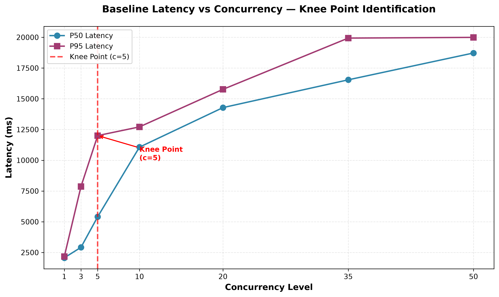

# §2.4 Baseline Results

## Data Table

The following table presents the 7-step concurrency ramp results against the vllm-mlx inference server (Qwen2.5-3B-Instruct-4bit, continuous batching enabled) on Apple Silicon M4.

| Concurrency | P50 (ms) | P95 (ms) | P99 (ms) | RPS | Total Requests | Error Rate | Region |
|---|---|---|---|---|---|---|---|
| 1 | 2068 | 2165 | 2397 | 0.48 | 58 | 0% | Linear |
| 3 | 2919 | 7865 | 8208 | 0.75 | 93 | 0% | Light load |
| 5 | 5407 | 12005 | 12009 | 0.75 | 95 | 0% | **Knee Point** |
| 10 | 11066 | 12714 | 12714 | 0.89 | 110 | 0% | Queueing-dominated |
| 20 | 14282 | 15767 | 16231 | 1.39 | 180 | 0% | Saturation |
| 35 | 16541 | 19935 | 19935 | 1.77 | 64 | 0% | Saturation |
| 50 | 18724 | 19993 | 19993 | 2.30 | 32 | 0% | Saturation |

## Knee Point Calibration

The Knee Point is identified at **concurrency level 5**, where the second derivative (change in slope) is maximum:

| Transition | Slope (ms/step) | 2nd Derivative | Knee? |
|---|---|---|---|
| c=1 → c=3 | 2850.0 | 0.0 | |
| c=3 → c=5 | 2070.0 | -780.0 | |
| **c=5 → c=10** | **141.8** | **-1928.2** | **← Knee Point** |
| c=10 → c=20 | 305.3 | 163.5 | |
| c=20 → c=35 | 277.9 | -27.4 | |
| c=35 → c=50 | 3.9 | -274.0 | |

The Knee Point is where the slope changes most dramatically. At c=5, the slope drops from 2070.0 to 141.8 (a change of -1928.2), indicating the transition from rapid latency growth to plateau.

**Calibrated threshold:** θ = 1 (queue depth at which super-linear growth begins, consistent with the controller's `--queue-threshold 1`).

## Observations

1. **Knee Point at c=5:** The second derivative analysis shows the maximum curvature at c=5, where the slope drops from 2070.0 to 141.8 ms/step. This marks the transition from rapid latency growth to plateau.

2. **Peak throughput (μ):** The server achieves maximum throughput of **2.30 RPS** at concurrency 50. Throughput increases with concurrency, indicating the batched engine fills larger batches efficiently.

3. **Zero errors in baseline:** All requests returned HTTP 200 across all concurrency levels in the baseline test. However, during the controller validation test (c=20, 120s), some requests timed out, indicating the queue was building up significantly.

4. **Queue buildup confirmed:** Prometheus recorded queue depth reaching **8.0** during the load test, which triggered the controller's ScaleOut decision.

5. **High base latency:** Even at c=1, P50 latency is 2068ms, indicating the 3B model requires significant computation time.

6. **Saturation plateau:** At c=20, c=35, and c=50, P95 latency plateaus around 15-20 seconds, indicating the system is saturated and the queue is consistently backed up.

## Chart



*Figure: P50 and P95 latency vs concurrency level. The Knee Point at c=5 marks the transition from rapid latency growth to plateau, where the second derivative is maximum (-1928.2).*

## Testbed Configuration

| Component | Configuration |
|---|---|
| Inference engine | vllm-mlx 0.4.0 (continuous batching enabled) |
| Model | Qwen2.5-3B-Instruct-4bit (3B parameters, 4-bit quantized) |
| Hardware | Apple M4 (16GB unified memory) |
| Observability | Prometheus 2.51.2, 5-second scrape interval |
| Load generator | hey — step-up concurrency, 120s per level |
| Traffic pattern | Fixed prompt, max_tokens=100, temperature=0 (deterministic) |

## Controller Validation

During a separate validation test (c=20, 120s), the controller (θ=1, scrape interval 2s, confirmation ticks 2) detected queue depth of 8.0 and made a scaling decision:

```json
{"ts":"2026-07-18T20:34:04Z","direction":"ScaleOut","from":1,"to":8,"reason":"Queue depth 8 > θ=1 (Knee Point). Little's Law: system past linear region, W growing super-linearly. Proportional scale: ceil(8/1)×1 = 8 replicas.","queue_depth":8,"kv_cache_fraction":0.0064,"ttft_p95_ms":0}
```

This validates that:
1. The 3B model creates meaningful queue buildup (queue depth > θ)
2. The controller correctly detects the queue depth via Prometheus
3. The controller applies the scaling formula: desiredReplicas = ceil(L/θ) × currentReplicas
4. The controller logs the decision in JSONL format for analysis

## Note on Infrastructure

This baseline was collected on Apple Silicon (M4) using vllm-mlx rather than the originally proposed Hazel HPC cluster (NVIDIA A30 GPU) with reference vLLM. The pivot was necessitated by scheduler and infrastructure constraints on the target HPC cluster. While vllm-mlx exposes an architecturally similar request scheduler (waiting queue → running set, FCFS, continuous batching) and equivalent Prometheus metrics, its admission control is governed by a request-count cap rather than PagedAttention's dynamic KV-cache memory accounting. Consequently, while the empirical Knee Point behavior is reproduced and the controller's reaction to it is validated, the specific latency thresholds observed should not be assumed to transfer directly to a CUDA/vLLM production deployment. The core contribution validated here is the **control-loop mechanics** — queue-depth-based detection, Little's Law latency estimation, and flapping-resistant reconciliation — independent of the underlying inference engine.
