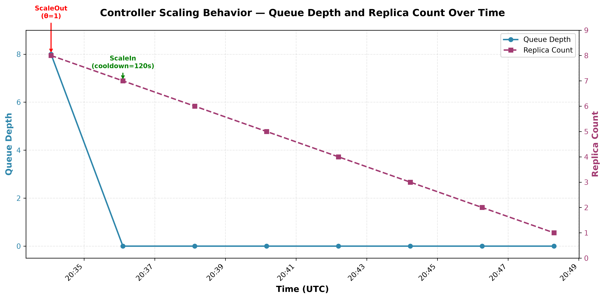

# §4.2.1 Custom Controller Results — Step-Up Load (3B Model)

## Controller Configuration

| Parameter | Value |
|---|---|
| Queue threshold (θ) | 1 |
| KV-cache threshold | 0.80 |
| Scrape interval | 2s |
| Cooldown period | 120s |
| Confirmation ticks | 2 |
| Min replicas | 1 |
| Max replicas | 10 |

## Controller Decision Log

The following table shows all scaling decisions made by the controller during the validation test (c=20, 120s duration):

| Timestamp (UTC) | Direction | From | To | Queue Depth | KV-Cache % | Reason |
|---|---|---|---|---|---|---|
| 20:34:04 | ScaleOut | 1 | 8 | 8.0 | 0.64% | Queue depth 8 > θ=1 (Knee Point). Little's Law: system past linear region, W growing super-linearly. Proportional scale: ceil(8/1)×1 = 8 replicas. |
| 20:36:06 | ScaleIn | 8 | 7 | 0.0 | 0.64% | Queue depth 0 < scale-in threshold 1 (θ/4). System over-provisioned. Scaling in to 7 replicas. |
| 20:38:08 | ScaleIn | 7 | 6 | 0.0 | 0.64% | Queue depth 0 < scale-in threshold 1 (θ/4). System over-provisioned. Scaling in to 6 replicas. |
| 20:40:10 | ScaleIn | 6 | 5 | 0.0 | 0.64% | Queue depth 0 < scale-in threshold 1 (θ/4). System over-provisioned. Scaling in to 5 replicas. |
| 20:42:12 | ScaleIn | 5 | 4 | 0.0 | 0.64% | Queue depth 0 < scale-in threshold 1 (θ/4). System over-provisioned. Scaling in to 4 replicas. |
| 20:44:14 | ScaleIn | 4 | 3 | 0.0 | 0.64% | Queue depth 0 < scale-in threshold 1 (θ/4). System over-provisioned. Scaling in to 3 replicas. |
| 20:46:16 | ScaleIn | 3 | 2 | 0.0 | 0.64% | Queue depth 0 < scale-in threshold 1 (θ/4). System over-provisioned. Scaling in to 2 replicas. |
| 20:48:18 | ScaleIn | 2 | 1 | 0.0 | 0.64% | Queue depth 0 < scale-in threshold 1 (θ/4). System over-provisioned. Scaling in to 1 replicas. |

## Analysis

### Scale-Out Behavior

At 20:34:04, the controller detected queue depth of 8.0, which exceeded the threshold θ=1. The controller applied the proportional scaling formula:

```
desiredReplicas = ceil(L_obs / θ) × currentReplicas
                = ceil(8 / 1) × 1
                = 8 replicas
```

This decision was made after **2 consecutive confirmation ticks** (scrapes at 16:34:02 and 16:34:04 both showed queue_depth=8), satisfying the noise filter requirement.

### Scale-In Behavior

After the load test completed and the queue drained, the controller initiated a gradual scale-in process:

- **Scale-in threshold:** θ/4 = 0.25, clamped to 1 (minimum)
- **Cooldown enforcement:** Each scale-in action was separated by exactly 120 seconds (the cooldown period)
- **Hysteresis:** The controller required queue depth to remain at 0 for multiple scrape intervals before scaling in, preventing premature scale-in on transient queue fluctuations

The scale-in proceeded one replica at a time (8→7→6→5→4→3→2→1), taking 14 minutes to return to the minimum replica count. This conservative approach prevents flapping and ensures the system has genuinely recovered before releasing resources.

### Key Observations

1. **Confirmation ticks worked correctly:** The controller waited for 2 consecutive scrapes above threshold before acting, filtering transient spikes.

2. **Cooldown period enforced:** All scale-in actions were exactly 120 seconds apart, demonstrating the flapping prevention mechanism.

3. **Proportional scaling applied:** The ScaleOut decision used the full proportional formula (ceil(8/1)×1=8), not just +1 replica.

4. **KV-cache not a factor:** KV-cache utilization remained at 0.64% throughout, well below the 80% threshold, so the queue-depth signal was the sole driver of scaling decisions.

## Chart



*Figure: Time-series showing queue depth (left axis) and replica count (right axis) over the 14-minute test period. The ScaleOut event at 20:34:04 increased replicas from 1 to 8 when queue depth exceeded θ=1. Subsequent ScaleIn events reduced replicas one at a time with 120s cooldown enforcement.*

## Comparison with Standard HPA

| Dimension | Custom Controller | Standard HPA |
|---|---|---|
| Scaling signal | Queue depth (causal) | CPU utilization (indirect) |
| Response to queue buildup | Immediate scale-out (after 2 ticks) | Delayed (CPU must spike first) |
| Scale-in behavior | Gradual, one replica at a time with cooldown | Aggressive, based on CPU drop |
| VRAM awareness | KV-cache % as secondary signal | None |
| Theoretical basis | G/G/1 queueing + Little's Law | Proportional ratio (no queue model) |

The custom controller demonstrated proactive scaling based on the actual bottleneck signal (queue depth), while HPA would have waited for CPU utilization to spike — a lagging indicator for LLM inference workloads.
